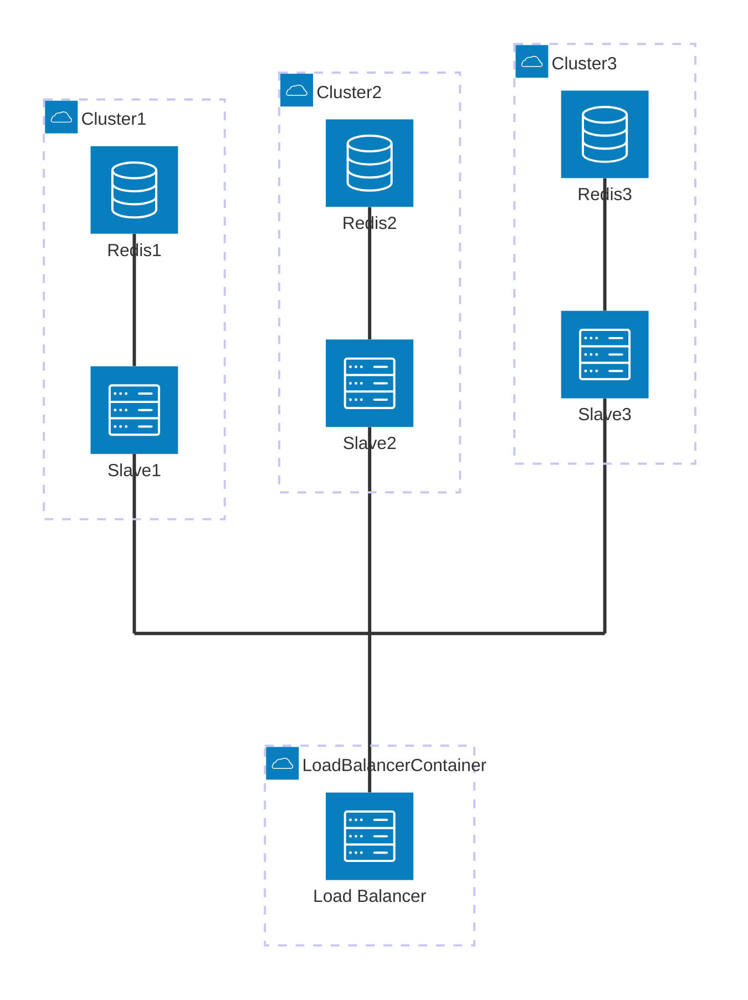

# Q1-Q2 - Docker config + Scale up (5 + 5 points)

**Objectif :** Mettre en place un environnement conteneurisé avec un **load balancer** et des **clusters** (consult-db-slave + Redis) fonctionnels (Q1), puis permettre de **faire varier facilement** le nombre d’instances (Q2).

## Instructions

### Q1 - Docker config

- Corriger et construire l'image contenant Redis et le serveur TypeScript (consult-db-slave).
- Construire l'image du load-balancer et permettre l'accès aux ressources via ce dernier.
- Mettre en place la réseautique via `docker-compose` **sans** mode `host`.
- Démarrer l’environnement via un script et rendre les ressources accessibles via le load balancer (utilisation de docker-compose permise).

### Q2 - Scale up

- Rendre la quantité de containers facilement modifiable (exemple : `./launch-env 5`).
- Supporter l’attribution dynamique des IP/URLs/domaines si nécessaire.
- À défaut, fournir une procédure claire expliquant comment changer le scale.

## Livrables attendus

### Q1 - Docker config

- Script de build (ex: `.ps1` ou `.sh`).
- Script de démarrage (ex: `.ps1` ou `.sh`) qui lance l’environnement (les deux scripts peuvent être combinés).
- `docker-compose.yml` et Dockerfiles ajustés si nécessaire.
- Autres modifications aux fichiers de configuration requis.

### Q2 - Scale up

- Le script de démarrage accepte un paramètre de scale (ex: `./launch-env 5`).
- Une courte procédure de mise à l’échelle si le scaling n’est pas entièrement automatique.

## Contraintes techniques

- L’utilisation du mode réseau `host` de Docker est interdite.
- Vous n’avez pas besoin de gérer la logique “runtime” (ex: redémarrage d’un cluster tombé), uniquement la configuration et le scaling.

## Architecture attendue

Voici l'architecture qui vous est fournie, et ce qu'on s'attend à ce qu'elle fasse une fois réparée :

- **1 container** exécutant l'application pour la distribution des tâches (load-balancer).
- **2 ou + containers "dupliqués"** acceptant des tâches de lecture/écriture dans une cache (consult-db-slave).
- Chaque container possède sa propre cache Redis, mais une seule cache est utilisée à un moment donné (voir la logique d'élection de "Redis-leader" implémentée dans le load-balancer / consult-db-slave).

## Indices

### Fichiers de Configuration

- Pour commencer, examinez brièvement le fichier `index.ts`, en particulier les 30 premières lignes. Ils contient des indices sur ce qui doit être configuré dans Docker
  (et possiblement les fichiers `my-deployments-config.json` aussi).

### Faite des tests

- Vérifiez si l'API fonctionne normalement avec des commandes comme `list-keys`, `get`, `set`, etc. (voir #Routes).
- Arrêtez un des clusters. Le système doit rester "healthy", même si l'ensemble n'est pas totalement fonctionnel.
- Vérifiez si votre méthode de mise à l'échelle fonctionne.

## Considérations

- La logique de gestion des erreurs des protocoles n'a pas besoin d'être ajustée, sauf pour l'extraction des listes d'IP / domaines.
- Si un cluster particulier est arrêté, les informations sont perdues (pas de réplication de données). Une élection doit être déclenchée après X échecs parmi les clusters restants.

## Ressources

- Docker Compose : https://docs.docker.com/compose/
- Redis : https://redis.io/docs/latest/

## Graphe de Déploiement

Considérez ce graphe pour comprendre l'architecture du load balancing.  
Certaines connexions doivent être créées et ne sont pas affichées dans ce graphe, notamment les connexions entre les "Slaves" et les instances Redis des autres clusters (exemple : la connexion entre Slave1 et Redis3).

(Si vous utilisez VSCode pour visualiser ce graphe, une extension est disponible : [Mermaid Extension](https://marketplace.visualstudio.com/items?itemName=bierner.markdown-mermaid))  
(GitHub supporte nativement les graphiques Mermaid.)

## Critères d'évaluation

| Critère                | Points | Description                                                                                |
| ---------------------- | -----: | ------------------------------------------------------------------------------------------ |
| **Q1 — Docker config** |      5 | Images + `docker-compose` (sans `host`) + démarrage scripté + accès via load balancer      |
| **Q2 — Scale up**      |      5 | Mise à l’échelle simple (paramètre) + adressage dynamique + procédure claire si nécessaire |
| **Total**              | **10** |                                                                                            |
